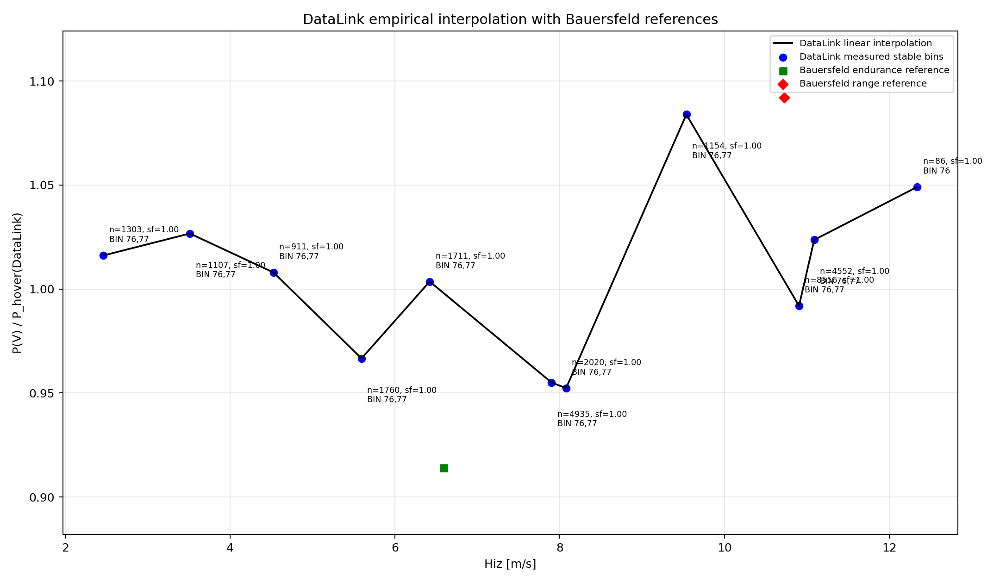
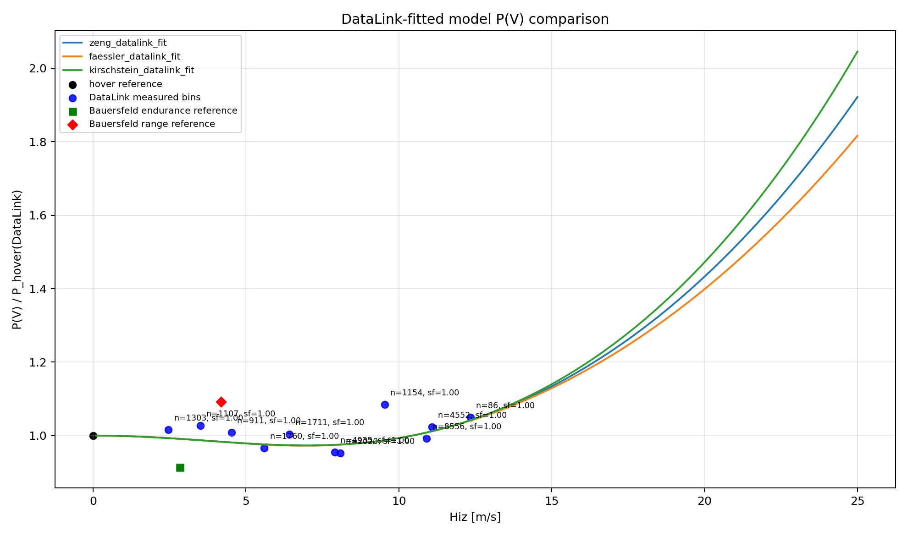
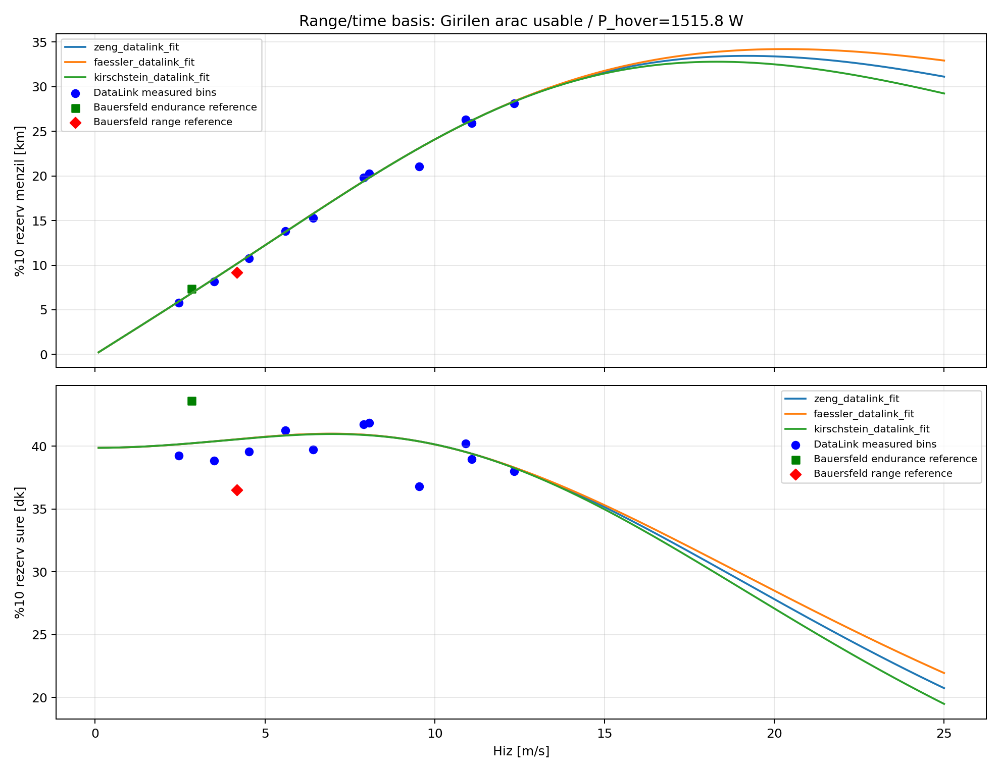

# Multicopter Battery and Range Calculation Toolkit

This repository contains an interactive Python workflow for estimating multicopter hover endurance, forward-flight range, and DataLink-calibrated power-speed behavior. The current working entry point is `menzil2.py`. Other Python files are retained primarily for legacy reference, earlier exploratory calculations, or compatibility with previous development steps; routine users should start with `menzil2.py` unless they are deliberately auditing historical calculations.

## Primary Scope

`menzil2.py` combines motor data, battery energy assumptions, empirical DataLink measurements, and several fitted power-speed model families. The most important current workflow is the DataLink-assisted analysis based on the 3 July flight logs. In that workflow, measured motor telemetry and ArduPilot log data are used to infer a normalized power curve, compare fitted model families, and convert those curves into endurance and range estimates.

When the fitted models are applied to a different aircraft, an optional **physical parameter transfer** step (enabled by default) decomposes the fit into dimensionless aerodynamic coefficients (profile `delta*sigma`, induced `1+k`, parasite `CdA`, rotor drag `lambda/W`, Kirschstein `lift/N`) and rebuilds the power-ratio curves from the entered aircraft's mass, rotor count, propeller, and tip speed. Applying the transfer back to the calibration aircraft reproduces the original curves exactly, so the legacy frozen-shape behavior is a special case. The motivation and validation for this design are documented in `mukerrer_egri_davranisi_raporu.md` (in Turkish): the three fitted families are statistically indistinguishable inside the measured speed range, so only a physics-based transfer can make them diverge meaningfully across aircraft.

The code is intended as an engineering analysis tool rather than a certified flight-performance predictor. Its outputs should therefore be interpreted as model-based estimates whose validity depends on the selected battery chemistry, the representativeness of the input logs, and the similarity between the calibrated aircraft and the aircraft being evaluated.

## Installation

Use Python 3.10 or newer. The repository has been used with Python 3.12.

```powershell
git clone https://github.com/tzi4/Multicopter-Battery-and-Range-Calculations.git
cd Multicopter-Battery-and-Range-Calculations

python -m venv .venv
.\.venv\Scripts\activate

python -m pip install --upgrade pip
pip install -r requirements.txt
python menzil2.py
```

On macOS or Linux, activate the environment with:

```bash
source .venv/bin/activate
```

## Recommended Usage

Run the program with:

```powershell
python menzil2.py
```

The script opens an interactive menu. Enter the aircraft mass, battery configuration, motor selection, and requested analysis mode when prompted. For current work, the recommended path is the `Preset/log DataLink fit analysis` option (menu option 3).

**If you are not an advanced user, simply press Enter at every prompt to accept the defaults, and only type the flight speeds you want evaluated when the speed list is requested.** The defaults already select the calibrated fit source, all three DataLink-fitted models, the physical parameter transfer with the datasheet-based theoretical tip speed, and graph generation.

Advanced users can override the transfer (`h` reuses the frozen calibration curve shape instead of rebuilding it from the entered aircraft's physics), the tip-speed source (datasheet-based theoretical Utip is the default; the calibration aircraft's measured value or a manual value can be selected instead), and the graph option at the corresponding prompts.

Selecting all DataLink-fitted models produces the power-ratio and range/time figures shown below. The empirical interpolation figure is produced separately by the raw DataLink data viewer (menu option 5).

### Battery Chemistry Requirement

When Konino Li-ion or solid-state Li-ion packs are used, the battery type prompt must be answered with `LiIon`. Selecting `LiPo` or `LiHV` for Konino packs applies the wrong voltage and energy convention, so the resulting endurance and range values will not be physically consistent with the current calibration. In short: Konino batteries should be modeled with the `LiIon` option.

### DataLink RPM Scale

The raw `RPM` field in T-MOTOR DataLink `.udat` records is not mechanical RPM: it is an eRPM-derived value (the U8 Lite is a 36N42P motor with 21 pole pairs, and a KV190 motor on 6S cannot mechanically exceed roughly 4200 RPM even unloaded). The parser therefore converts the raw field with `DATALINK_RPM_SCALE = 10/21`. The corrected hover point (about 2143 RPM, tip speed about 80 m/s) agrees with the official KV190 datasheet load-test table to within a few percent. Any external tooling that reads the same `.udat` files should apply the same conversion.

## Default 3 July Data Set

The repository includes the 3 July DataLink and ArduPilot log data used by the current calibrated workflow:

```text
3 Temmuz Tüm Test Logları/
  00000076.BIN
  00000077.BIN
  Datalink/
    UART-260703-.../
      *.udat
```

If no custom DataLink/log folder is supplied in the main DataLink analysis path, `menzil2.py` searches the repository directory for a folder whose name starts with `3 Temmuz` and uses it as the default log root. The default date hint is `260703`, corresponding to 3 July 2026 in the log naming convention.

Additional flight data can be added by imitating the same structure:

```text
<new-log-folder>/
  <ArduPilot log>.BIN
  Datalink/
    UART-YYMMDD-HHMMSS/
      UART-YYMMDD-HHMMSS-HHMMSS.udat
```

When using a different data set, provide the new folder path at the DataLink/log folder prompt and provide the matching `YYMMDD` date hint. The folder layout matters because the code matches ArduPilot `.BIN` time spans against DataLink `.udat` sessions.

## Figures

The figures below were generated from the included 3 July DataLink data with all DataLink-fitted model families enabled.

### Empirical DataLink Interpolation



This figure shows the measured stable speed bins extracted from the joined DataLink and ArduPilot samples. The black curve is a within-range empirical interpolation of the observed normalized power ratio, `P(V) / P_hover(DataLink)`. Bauersfeld reference markers are shown for qualitative comparison, but the interpolation itself is measurement-driven. This plot belongs to the calibration data itself, not to any fitted model, so it is generated by the raw DataLink data viewer (menu option 5, as `raw_datalink_empirical_interpolation.png`) rather than by the preset fit flow.

### Fitted Power-Speed Model Comparison



This plot compares the DataLink-fitted Zeng, Faessler, and Kirschstein model families against the measured bins. The vertical axis is normalized by the measured DataLink hover reference, which makes the figure useful for comparing curve shape independently of the absolute battery capacity used later in the range calculation.

### Range and Endurance Projection



This figure converts the fitted power-speed curves into practical outputs: range at 10 percent reserve and endurance at 10 percent reserve. The projection depends on both the fitted power ratio and the selected range/time battery basis. Therefore, changing the aircraft battery, reserve convention, or hover reference changes the numerical result even when the normalized curve shape remains the same.

## Tests

```powershell
python -m pytest -q
```

The main suite (`test_menzil2_july3_measured_curve.py`) parses the real 3 July logs included in the repository, so a full run takes roughly 30-40 seconds. `test_menzil2_transfer.py` covers the physical parameter transfer (identity and mass-sensitivity guarantees) and the theoretical Utip estimators. The two fixture tests in `test_menzil2_datalink.py` additionally require a local `Some Datalink Data/datalink/` folder with the June 2026 UART sessions; that data set is not tracked in git, so those two tests only pass on machines that have it.

## Repository Layout

- `menzil2.py`: the current primary interactive analysis program.
- `CLAUDE.md`: condensed project notes for coding agents and new contributors (conventions, pitfalls, test commands).
- `mukerrer_egri_davranisi_raporu.md`: diagnosis report (Turkish) explaining why the three fitted model curves are indistinguishable inside the measured range, the physical parameter transfer design, and the DataLink RPM scale finding.
- `requirements.txt`: Python dependencies required for the current workflow.
- `3 Temmuz Tüm Test Logları/`: default DataLink and ArduPilot logs for the calibrated 3 July analysis.
- `flight_attitude_00000075.csv` and `flight_attitude_00000075_armed.csv`: attitude-derived support data used by the model-fitting workflow.
- `test_menzil2_*.py`: pytest suites for the DataLink pipeline, the 3 July calibrated workflow, and the parameter transfer.
- `Some Datalink Data/` (local only, not tracked): earlier June 2026 DataLink sessions used as test fixtures.
- `menzil1.py` and other Python scripts: legacy or auxiliary files retained for comparison, continuity, and earlier analyses.

## License

This project is distributed under the MIT License. See `LICENSE` for details.
