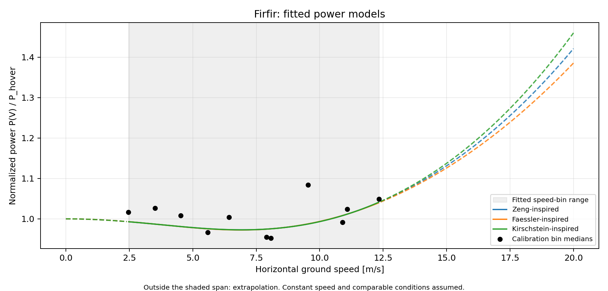
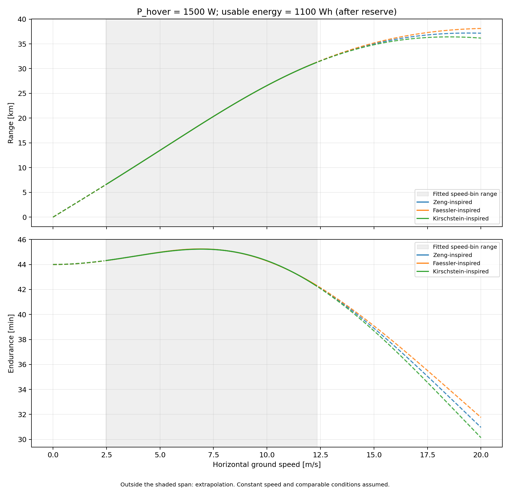

# Multicopter Battery and Range Calculator

**[Live HTML demo](https://tzi4.github.io/Multicopter_Battery_and_Range_Calculations/aircraft-demo.html)** ·
**[HTML code: docs/aircraft-demo.html](docs/aircraft-demo.html)** ·
**[Which Python file should I run?](#start-here)**

**Start with a preflight estimate. Refine it with your own flight data.**

Before the first flight, estimate range and endurance from the aircraft's
geometry, hover power and battery energy. After a representative flight, use
its logs to fit three power models and compare the speeds, power demands and
flight times you can expect on subsequent flights of the same aircraft.

The project brings these two stages together in Python. Edit the example
inputs for your aircraft and logs, then keep the fitted model for your next
calculation.

| Stage | What you provide | What you get |
|---|---|---|
| **Before flight — first estimate** | Mass, rotor geometry, reference area, hover-power estimate and battery energy | Bauersfeld best-range and best-endurance speeds, power, time and range |
| **After flight — calibrated estimate** | Flight logs, aircraft configuration and an electrical hover reference | Zeng, Faessler-inspired and Kirschstein-inspired curves; two comparison plots; a reusable saved fit |

> [!IMPORTANT]
> The included logs and fitted curves come from one specific aircraft. Use them
> as a worked example, and **fit your own logs before planning with these models**.
> A saved fit describes the aircraft and conditions used for calibration;
> changes in payload, propulsion or operating conditions need a new check.

**46,175 calibration samples · 30,782 later-flight samples · 3 fitted model families · 4 research papers**

## Interactive aircraft demo

**[Open the interactive demo in your browser →](https://tzi4.github.io/Multicopter_Battery_and_Range_Calculations/aircraft-demo.html)**

The complete HTML, JavaScript and styles are in
**[`docs/aircraft-demo.html`](docs/aircraft-demo.html)**.
In GitHub's **Code** tab, open **docs → aircraft-demo.html** to find the file.
Use the live-demo link above to open the running interface.

Explore the author's aircraft by changing its mass, motor, propeller and battery
inputs, and watch the Zeng power, range and endurance plots update. No installation
is needed. The demo uses the current G29 fit; use the Python workflow below to
fit your own logs and compare all three models.

[HTML source: docs/aircraft-demo.html](docs/aircraft-demo.html) ·
[Download for offline use](https://raw.githubusercontent.com/tzi4/Multicopter_Battery_and_Range_Calculations/main/docs/aircraft-demo.html) ·
[Demo notes](docs/AIRCRAFT_DEMO.md)

## Start here

Most users should start with `csv_starter.py` to learn the workflow, then use
`postflight_fit.py` for their own ArduPilot BIN logs. For a first estimate
before collecting logs, run `preflight_estimate.py`.

| What you want to do | Python file to edit and run | Main output |
|---|---|---|
| Try the workflow, or fit your own synchronized CSV | [`examples/csv_starter.py`](examples/csv_starter.py) | Saved fit, two plots and `fit-report.md` |
| Get a first estimate before flight | [`examples/preflight_estimate.py`](examples/preflight_estimate.py) | Best-range and best-endurance speeds, time and range |
| Fit your own ArduPilot BIN flight | [`examples/postflight_fit.py`](examples/postflight_fit.py) | Saved fit, two plots and `fit-report.md` |
| Reproduce the author's full two-stage example | [`examples/analyze_aircraft.py`](examples/analyze_aircraft.py) | First estimate and fit of the bundled July 3 archive |

Shared geometry and battery defaults are in
[`examples/aircraft_inputs.py`](examples/aircraft_inputs.py). For your own logs,
also set the file path and calibrated electrical references in the selected
example. Run it with `python examples/<filename>.py` after installation.
See the [examples directory guide](examples/README.md) for the complete file map.

## Try the small CSV starter

[Download the starter ZIP](https://tzi4.github.io/Multicopter_Battery_and_Range_Calculations/downloads/csv-starter.zip)
to try the Python workflow without the full log archive. Extract it, open the
folder in a Python 3.10+ environment, and run:

```bash
python -m pip install -e .
python examples/csv_starter.py
```

It fits a compact real-flight CSV and writes `aircraft-fit.json`, both main
plots and **`fit-report.md`** into `starter-output/`. The report shows the
inputs, retained data, fitted speed range and a prediction at your chosen speed.
[Starter guide, editable inputs and expected outputs](docs/CSV_STARTER.md).

## Install

Python 3.10 or newer is required. The clone includes 126 MB of calibration
inputs; allow at least 1 GB for the repository and Python environment.

```bash
git clone https://github.com/tzi4/Multicopter_Battery_and_Range_Calculations.git
cd Multicopter_Battery_and_Range_Calculations
python3 -m venv .venv
source .venv/bin/activate
python -m pip install -e .
```

On Windows PowerShell, create and activate the environment with
`py -3 -m venv .venv` and `.\.venv\Scripts\Activate.ps1` instead.

## Run the author's aircraft example

Edit [`examples/aircraft_inputs.py`](examples/aircraft_inputs.py), then run:

```bash
python examples/analyze_aircraft.py
```

This single entry point runs the first estimate, fits the included aircraft
logs, saves the coefficients and generates the two main plots. The defaults
follow the author's saved working setup: **12.4 kg, U8 Lite KV190 / G29, four
rotors, 450 cm², two 6S 27 Ah Li-ion packs, and empirical CF ≈ 0.616**.
The stages remain available separately, as shown below.

## 1. Before flight: get a first estimate

The first stage uses the inputs in
[`examples/aircraft_inputs.py`](examples/aircraft_inputs.py). Its Python call is:

```python
from multicopter_range import BauersfeldRangeCalculator

estimate = BauersfeldRangeCalculator(
    hover_power_w=1101.6581196581196,  # Four G29 manufacturer-table motors [W].
    correction_factor=0.6159319356120826,  # Author's empirical correction.
    battery_wh=1198.8,         # Two 6S, 27 Ah Li-ion packs [Wh].
    total_mass_kg=12.4,
    drag_area_cm2=450.0,        # Projected reference area, not CdA.
    prop_diameter_inch=29.0,
    num_rotors=4,
).solve()

print(f"Range: {estimate['max_range_km']:.2f} km")
print(f"Endurance: {estimate['max_endurance_min']:.2f} min")
```

Run this stage with `python examples/preflight_estimate.py`.
The saved inputs give **23.69 km at 10.72 m/s** for best range and
**44.00 minutes at 6.59 m/s** for best endurance.

The author used an empirical correction of approximately **0.62** with the
team's own multicopters with cylindrical arms. The recovered reference is a
35-minute Vibe hover versus a 56.82-minute theoretical estimate. This is the
author's working calibration, not a universal Bauersfeld coefficient or a
measured battery-capacity fraction. [Defaults and CF derivation](docs/AUTHOR_DEFAULTS.md).

## 2. After flight: fit once, reuse the model

Record steady flight at several speeds, including hover. Supply your aircraft
configuration and calibrated power measurements, then fit the three model
families. The saved fit can estimate power at a requested speed; a hover-power
and usable-energy input turns that ratio into watts, minutes and kilometres.

Open [`examples/postflight_fit.py`](examples/postflight_fit.py), set your log
path and aircraft inputs in the file, and run `python examples/postflight_fit.py`.
The workflow looks like this:

```python
from flight_workflow import Aircraft, fit_flight, load_ardupilot_log

samples = load_ardupilot_log(
    "my-logs/flight.BIN",
    power_source="battery",    # Use a calibrated whole-aircraft BAT monitor.
    battery_instance=0,
)
aircraft = Aircraft(
    name="My multicopter",
    mass_kg=12.4,
    num_rotors=4,
    prop_diameter_inch=29.0,
    reference_area_m2=0.045,
    hover_rpm=2149.761904761904,
)
fit = fit_flight(samples, aircraft, hover_power_w=1485.6942539603501)
outputs = fit.export(
    "my-flight-output", hover_power_w=1485.6942539603501,
    usable_energy_wh=1006.992, speed_ms=10.0,
)
```

These values follow the author's saved scenario. Replace the log path and
electrical reference with your own measurements before fitting a new flight.
The loader also accepts ESC telemetry; a documented CSV format supports synchronized data from other loggers. See the [usage guide](docs/USAGE.md)
for exact fields, units, power-source selection and log requirements.

`export()` saves the fit, generates both figures and writes a short Markdown
report with relative links to the output files. It distinguishes the log's
normalization power from the power and usable energy used for predictions.

For subsequent estimates, load the JSON without reading the logs again:

```python
from flight_workflow import FlightFit

fit = FlightFit.load("my-flight-output/aircraft-fit.json")
for name, prediction in fit.predict(
    speed_ms=10.0, hover_power_w=1485.6942539603501, usable_energy_wh=1006.992
).items():
    print(name, prediction)    # Power ratio, watts, minutes, km and fit-range status.
```

### The two main plots

**Power versus speed:** `power_ratio.png` compares all three fitted
`P(V)/P_hover` curves with the measured speed bins. This is normalized
**electrical power**, not thrust-to-weight ratio. The flight-log input here is
EKF ground speed, which serves as an airspeed proxy in sufficiently calm flight.



**Range and endurance versus speed:** `range_endurance.png` shows how speed
changes distance and time for a declared hover-power and usable-energy basis.
Energy already excludes the reserve; no second reserve deduction is applied.



These plots use the current G29 fit and the saved report's electrical basis:
**1485.69 W hover and 1006.992 Wh after a 10% reserve**. This retains the
author's working assumptions; it is not a newly measured endurance result.
The empirical preflight CF is not applied again. [Energy basis](docs/AUTHOR_DEFAULTS.md).
Dashed curves identify speeds outside the fitted bin range.

To make them yourself, run `python examples/bundled_flight_demo.py`. Change its
shared inputs in `examples/aircraft_inputs.py` to explore speed and energy.
It rebuilds the published fit and writes the two figures, `aircraft-fit.json`
and `fit-report.md` into `flight-output/`.

## Flight results

**Aircraft scenario:** T-MOTOR U8 Lite KV190 · G29×9.5 CF · four rotors ·
6S · 12.4 kg assumed. Every plotted observation has downloadable data and a
reproducible calculation. Flight-specific mass is an explicit analysis input;
see the [configuration audit](docs/FLIGHT_CONFIGURATION.md).

### High-speed prediction beyond the fitted range

**Fitted at 2.46–12.34 m/s; checked at approximately 17 m/s on a later flight.**
The frozen Faessler-inspired model achieves **0.81% and 0.70% absolute residuals**
in the two highest-speed comparison bins, about **37–38% above the highest
speed-bin median used for fitting**. Both results use the same July 3 model,
without fitting its coefficients to the July 21 power observations.

| July 21 speed | Retained samples | Zeng absolute residual | Faessler-inspired | Kirschstein-inspired |
|---|---:|---:|---:|---:|
| 16.91 m/s | 4,256 | **0.27%** | **0.81%** | 1.43% |
| 17.07 m/s | 3,442 | 1.83% | **0.70%** | 3.03% |

These are two selected **bin-median power comparisons**. Errors are larger at
other operating points; they are not an overall accuracy score. July 3's raw
telemetry contains sparse higher-speed records; those did not enter the fitted power
bins. The complete nine-bin comparison and its wider error distribution are
shown below. [Exact results and selection](docs/results/validation-summary.json).

<details>
<summary>Full flight comparison and limitations</summary>


**Calibration:** 46,175 joined telemetry samples; 28,095 retained samples in
11 speed bins spanning 2.46–12.34 m/s. All retained bins are shown. Errors here
are measured on the data used to fit the curves. [Bin data](docs/results/calibration-bins.csv)
and [source hashes and full results](docs/results/calibration-summary.json).


**Later-flight comparison:** the July 3 coefficients remain fixed. All nine
bins retained by the documented July 21 selection are shown. This is a
retrospective comparison using ground speed; its timing and filters were
developed after inspecting the flight. Both dates use July 3's hover reference;
flight-specific mass changes have not been compensated.
[All bin results](docs/results/validation-bins.csv)
and [30,782 derived telemetry rows](data/validation/2026-07-21/).

| Fixed July 3 model | July 21 mean absolute percent residual, all nine bins |
|---|---:|
| Zeng | 11.76% |
| Faessler-inspired | 11.70% |
| Kirschstein-inspired | 12.01% |

The residual is `100 × (observation / prediction − 1)`; the table averages
its absolute value equally over the nine bins.

The [reproduction guide](docs/REPRODUCIBILITY.md) covers the complete comparison pipeline.

The plots report normalized electrical power; absolute endurance additionally depends on the
battery-energy and current-sensor interpretation described in
[Methodology](docs/METHODOLOGY.md).

</details>

## Which code does what?

The scripts users normally edit and run are in **[`examples/`](examples/README.md)**.
The two Python files at the repository root provide the calculation libraries:

- [`multicopter_range.py`](multicopter_range.py) contains the Bauersfeld
  calculator, original log parsers, model equations, fitting and transfer routines.
- [`flight_workflow.py`](flight_workflow.py) provides the Python interface for
  your own logs, saved fits, predictions, plots and reports. Import it into your
  own program to reuse a saved fit without reading the logs again.
- [`examples/aircraft_inputs.py`](examples/aircraft_inputs.py) holds the shared
  editable inputs; [`examples/analyze_aircraft.py`](examples/analyze_aircraft.py)
  runs both stages. Separate stage and research-reproduction scripts remain available.
- [`docs/USAGE.md`](docs/USAGE.md) explains every input and output;
  [workflow methodology](docs/WORKFLOW_METHOD.md) explains the custom-log fit.

The existing command-line interface remains available. Its historical
`analyze-calibration` preset reproduces the July 3 G28 configuration; use the
Python examples above for your own aircraft and the current G29 demonstration.
Wheels include the Python modules; the large bundled logs require a repository clone.

## Applying it to another aircraft

The inputs support aircraft-specific design studies, including **1–25 kg
configurations**, with suitable propulsion, power and energy measurements.
That flexibility is not an accuracy claim for the entire mass range. The
published flight comparison concerns one nominal 12.4 kg configuration.

A calibration flight gives a useful starting point for subsequent steady-flight
estimates. It cannot cover every manoeuvre, wind condition, battery state or
payload change. Check the saved model against a later flight before relying on
it for planning. Physical-parameter transfer is also available through the
original Python API; its assumptions are described in [Methodology](docs/METHODOLOGY.md).

## Data, tests and reproducibility

The [July 3 calibration data](data/calibration/2026-07-03/) include two ArduPilot
BIN logs, T-MOTOR DataLink sessions and the derived attitude CSV. The [July 21
comparison data](data/validation/2026-07-21/) provide 30,782 derived telemetry
rows. Raw BIN logs retain the original flight's GPS positions and autopilot
parameters. Source hashes, filters and electrical assumptions are recorded in
the [reproduction guide](docs/REPRODUCIBILITY.md) and
[configuration audit](docs/FLIGHT_CONFIGURATION.md).

```bash
python -m pip install -e '.[dev]'
python -m pytest -q
```

The tests include the real bundled logs, model regression checks and the custom
flight workflow. See [numerical validation](docs/VALIDATION.md) for the scope of
historical comparisons. Contributions are welcome; see
[CONTRIBUTING.md](CONTRIBUTING.md), [SECURITY.md](SECURITY.md) and
[CHANGELOG.md](CHANGELOG.md).

## License

Released under the [MIT License](LICENSE).

## Research references

The general range/endurance calculator follows Bauersfeld and Scaramuzza.
Flight calibration uses Zeng-type power curves, a Faessler-inspired drag prior,
and a Kirschstein-inspired component model. These locally fitted adaptations
do not inherit the original papers' accuracy claims.

- Bauersfeld & Scaramuzza (2022), *Range, Endurance, and Optimal Speed Estimates
  for Multicopters*. [Paper](https://doi.org/10.1109/LRA.2022.3145063).
- Zeng, Xu & Zhang (2019), *Energy Minimization for Wireless Communication With
  Rotary-Wing UAV*. [Paper](https://doi.org/10.1109/TWC.2019.2902559).
- Faessler, Franchi & Scaramuzza (2018), *Differential Flatness of Quadrotor
  Dynamics Subject to Rotor Drag for Accurate Tracking of High-Speed
  Trajectories*. [Paper](https://doi.org/10.1109/LRA.2017.2776353).
- Kirschstein (2020), *Comparison of energy demands of drone-based and
  ground-based parcel delivery services*.
  [Paper](https://doi.org/10.1016/j.trd.2019.102209) and
  [2022 corrigendum](https://doi.org/10.1016/j.trd.2022.103457).

See the [equation-to-code mapping and technical sources](docs/REFERENCES.md)
and [downloadable BibTeX](docs/references.bib).
