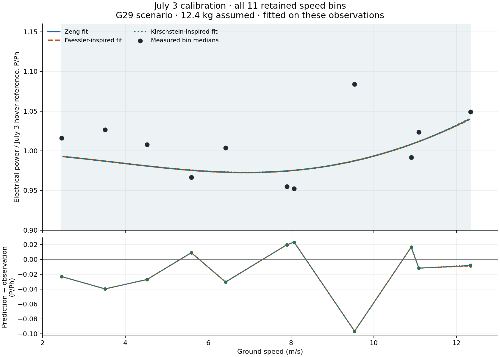
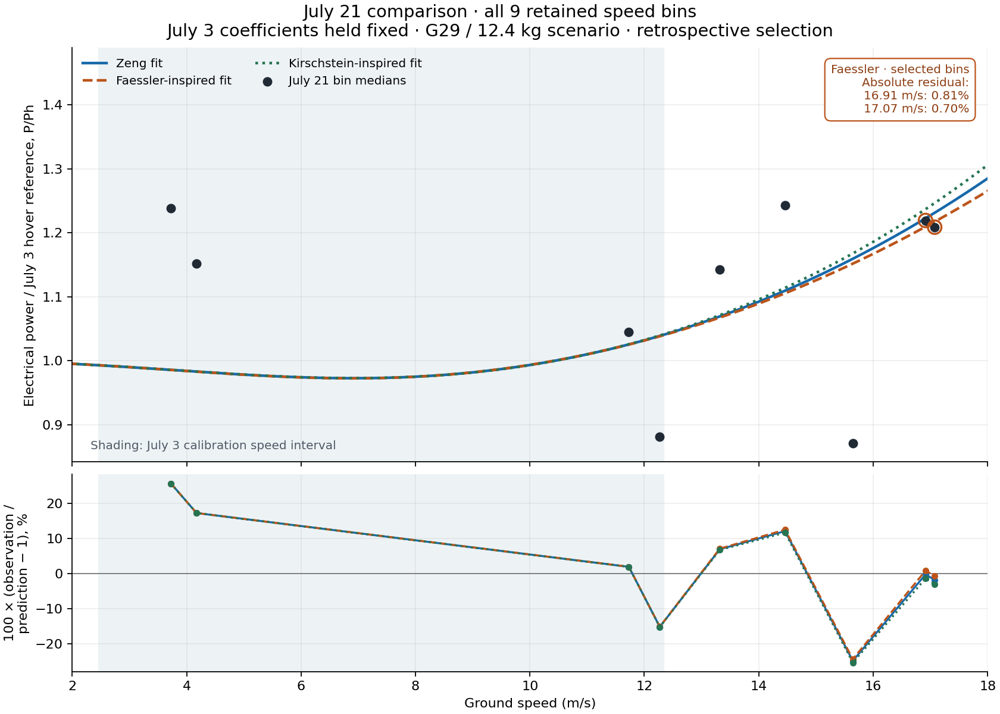

# Multicopter Battery and Range Calculator

**From real flight telemetry to reproducible multicopter power and range estimates.**

Fit and compare three power–speed models, estimate endurance and range, and
trace the results back to ArduPilot and T-MOTOR DataLink measurements. The
repository includes the calibration logs, later-flight comparison data,
publication-ready figures, and the scripts that connect them.

**46,175 calibration samples · 30,782 later-flight samples · 3 model families · 4 research papers**

## Features

- Estimates best-range speed, best-endurance speed, flight time, and range.
- Parses ArduPilot `.BIN` logs and T-MOTOR DataLink `.udat` telemetry.
- Fits Zeng, Faessler, and Kirschstein power-speed model families.
- Includes the complete 3 July 2026 calibration data set used by the tests.
- Transfers fitted physical parameters to another mass/rotor/propeller setup.
- Produces empirical and diagnostic plots for audit and comparison.

## Flight results

**Aircraft scenario:** T-MOTOR U8 Lite KV190 · G29×9.5 CF · four rotors ·
6S · 12.4 kg assumed. Every plotted observation has downloadable data and a
reproducible calculation. Flight-specific mass is an explicit analysis input;
see the [configuration audit](docs/FLIGHT_CONFIGURATION.md).

### High-speed prediction beyond the fitted range

**Fitted at 2.46–12.34 m/s; checked at approximately 17 m/s on a later flight.**
The frozen Faessler-inspired model achieves **0.81% and 0.70% absolute residuals**
in the two highest-speed comparison bins, about **37–38% above the highest
speed-bin median used for fitting**. Both results use the same July 3 model,
without fitting its coefficients to the July 21 power observations.

| July 21 speed | Retained samples | Zeng absolute residual | Faessler-inspired | Kirschstein-inspired |
|---|---:|---:|---:|---:|
| 16.91 m/s | 4,256 | **0.27%** | **0.81%** | 1.43% |
| 17.07 m/s | 3,442 | 1.83% | **0.70%** | 3.03% |

These are two selected **bin-median power comparisons**, not a claim that every
sample or every higher speed has sub-percent error. July 3's raw telemetry
contains sparse higher-speed records; those did not enter the fitted power
bins. The complete nine-bin comparison and its wider error distribution are
shown below. [Exact results and selection](docs/results/validation-summary.json).



**Calibration:** 46,175 joined telemetry samples; 28,095 retained samples in
11 speed bins spanning 2.46–12.34 m/s. All retained bins are shown. Errors here
are measured on the data used to fit the curves. [Bin data](docs/results/calibration-bins.csv)
and [source hashes and full results](docs/results/calibration-summary.json).



**Later-flight comparison:** the July 3 coefficients remain fixed. All nine
bins retained by the documented July 21 selection are shown. This is a
retrospective comparison using ground speed; its timing and filters were
developed after inspecting the flight. Both dates use July 3's hover reference;
flight-specific mass changes have not been compensated.
[All bin results](docs/results/validation-bins.csv)
and [30,782 derived telemetry rows](data/validation/2026-07-21/).

| Fixed July 3 model | July 21 mean absolute percent residual, all nine bins |
|---|---:|
| Zeng | 11.76% |
| Faessler-inspired | 11.70% |
| Kirschstein-inspired | 12.01% |

The residual is `100 × (observation / prediction − 1)`; the table averages
its absolute value equally over the nine bins.

Reproduce the data tables and figures after installation:

```bash
python examples/reproduce_showcase.py --prop-diameter 29 --mass 12.4 \
  --output-dir showcase-output --check-results docs/results
```

The plots report normalized electrical power; absolute endurance additionally depends on the
battery-energy and current-sensor interpretation described in
[Methodology](docs/METHODOLOGY.md).

## Main code and workflow

The main implementation is **[`multicopter_range.py`](multicopter_range.py)**.
The installed `multicopter-range` command calls that same file.

| Task | Entry point | Output |
|---|---|---|
| Estimate range/endurance for aircraft inputs | `multicopter-range calculate` | Best-range and best-endurance speeds, flight times, and maximum range in the terminal |
| Rebuild the bundled historical calibration | `multicopter-range analyze-calibration --graphs` | Joined-sample/bin counts, hover-power and tip-speed statistics, two PNG diagnostics and a fit audit |
| Reproduce the current G29 flight results | `python examples/reproduce_showcase.py` | Calibration/comparison JSON, bin CSV tables, Markdown audit, and PNG/SVG figures |

`calculate` uses the Bauersfeld range/endurance relationships with **your
aircraft's hover power and battery energy**. It does not automatically load
the three log-fitted curves. The showcase fits those curves from the included
July 3 data and evaluates them against July 21 observations. Python callers
can use `build_transferred_model_suite` to rebuild fitted curves for another
configuration. See the [usage guide](docs/USAGE.md) for commands, output files
and the fitted-model API.

### Applying the calculator to another aircraft

Mass, rotor count, propeller diameter, hover power, battery energy and reference
area are configurable. This supports **aircraft-specific design studies,
including 1–25 kg configurations**, when those inputs describe the actual
aircraft. The supplied fit comes from a nominal 12.4 kg configuration; it does
not establish accuracy throughout the 1–25 kg range. A new aircraft needs its
own measured electrical inputs and validation of any transferred model.

## Requirements

- Python 3.10 or newer
- Space for the repository history, the 126 MB calibration inputs, and a Python
  environment (allow at least 1 GB for a fresh clone and installation)

## Installation

```bash
git clone https://github.com/tzi4/Multicopter_Battery_and_Range_Calculations.git
cd Multicopter_Battery_and_Range_Calculations
python3 -m venv .venv
source .venv/bin/activate
python -m pip install --upgrade pip
python -m pip install -e .
```

On Windows PowerShell, create and activate the environment with:

```powershell
py -3 -m venv .venv
.\.venv\Scripts\Activate.ps1
```

## Quick start

Run a calculation from measured hover power and battery energy:

```bash
multicopter-range calculate \
  --hover-power 1500 \
  --battery-energy 1200 \
  --mass 12.4 \
  --drag-area 450 \
  --prop-diameter 29 \
  --rotors 4 \
  --correction-factor 0.93
```

Input definitions:

- `--hover-power`: measured electrical power for the **whole aircraft** during
  steady hover, in watts. Do not enter per-motor power.
- `--battery-energy`: energy basis for the whole battery pack, in watt-hours.
  Use nominal energy only when the correction factor accounts for unusable
  capacity; otherwise enter an independently measured usable-energy value.
- `--mass`: takeoff mass including the battery and payload, in kilograms.
- `--drag-area`: the projected reference area used by the Bauersfeld regression,
  in square centimetres. This is not the aerodynamic `CdA` used by the fitted
  forward-flight models.
- `--prop-diameter`: one propeller's diameter, in inches.
- `--rotors`: total load-bearing rotor count.
- `--correction-factor`: a dimensionless multiplier applied to available energy
  in the range/endurance calculation. Use `1.0` when `--battery-energy` is
  already usable energy. A value such as `0.93` means 93% of the entered energy
  is treated as usable. The tool does not infer this value for a new aircraft.

The example above produces:

```text
Induced hover velocity: 5.397 m/s
Best-range speed: 10.723 m/s
Best-range flight time: 40.879 min
Maximum range: 26.302 km
Best-endurance speed: 6.589 m/s
Maximum endurance: 48.840 min
```

The same command works without installation:

```bash
python multicopter_range.py calculate --hover-power 1500 --battery-energy 1200 \
  --mass 12.4 --drag-area 450 --prop-diameter 29 --rotors 4 --correction-factor 0.93
```

Rebuild the fitted models from the included raw logs:

```bash
multicopter-range analyze-calibration
```

Add `--graphs` to write `empirical_datalink_power_curve.png` and
`diagnostic_datalink_surrogate_fits.png`, plus `scientific_model_fit_audit.md`,
in the current directory. These are calibration diagnostics.

For a compact audit with input hashes, electrical measurements, and
per-model residuals:

```bash
python examples/reproduce_calibration.py \
  --data-root data/calibration/2026-07-03 --output-dir calibration-output
```

The example defaults to the G29 / 12.4 kg scenario shown above: 46,175 joined
samples, 11 stable speed bins and a tip-speed statistic of 82.912632 m/s.
The legacy `analyze-calibration` command retains its fixed G28 / 12.4 kg preset.
See the [reproduction and research audit](docs/REPRODUCIBILITY.md) for measured
results, the old 168.1 m/s report discrepancy, and the separate July 21 check.

Wheels and source distributions contain the calculator code but omit the large
flight logs. After installing a wheel, point to the data in a repository clone:

```bash
multicopter-range analyze-calibration --data-root /path/to/repository/data/calibration/2026-07-03
```

The directory must include both BIN logs, the DataLink sessions, and
`flight_attitude.csv`. This command uses the fixed July 3 aircraft profile;
the option relocates that data set and does not configure a new aircraft.

## Calibration data

The required raw logs are committed under
`data/calibration/2026-07-03/`:

```text
data/calibration/2026-07-03/
├── 00000076.BIN
├── 00000077.BIN
├── flight_attitude.csv
└── Datalink/
    └── UART-260703-*/
        └── *.udat
```

The `.BIN` files provide vehicle state and speed. The `.udat` files provide
per-motor voltage, current, and RPM. Both sources are needed because the
pipeline time-aligns them before creating stable speed bins. See
[the data notes](data/calibration/2026-07-03/README.md) and
[the methodology](docs/METHODOLOGY.md) for assumptions and known limitations.
The directly parsed power is the sum of four ESC `voltage × current` records.
The archive's additional factor of two assumes a particular sensor layout;
the physical wiring has not been established from these logs. Parallel battery
count alone does not justify doubling ESC power.

> [!IMPORTANT]
> The raw ArduPilot logs contain the original flight's GPS positions and
> non-secret autopilot parameters. Review this before redistributing the data.

The largest file is approximately 83 MB. Git LFS is not required; every file is
below GitHub's 100 MB per-file limit.

## Testing

```bash
python -m pip install -e '.[dev]'
python -m pytest -q
```

The full suite parses the real flight logs and may take around one minute.
For a fast unit and numerical-regression check:

```bash
python -m pytest -q tests/test_numerical_regression.py tests/test_transfer.py
```

The old and public implementations were also executed side by side over broad
input grids and the complete bundled telemetry set. See
[Numerical validation](docs/VALIDATION.md) for the exact comparison and scope.

## Project layout

- `multicopter_range.py` — calculator, telemetry parsers, model fitting, plots,
  and command-line interface.
- `data/calibration/2026-07-03/` — raw logs and the derived attitude input needed
  to reproduce the calibration.
- `tests/test_transfer.py` — model and physical-transfer unit tests.
- `tests/test_numerical_regression.py` — representative outputs captured from
  the pre-cleanup implementation.
- `tests/test_calibration.py` — end-to-end tests against the included logs.
- `docs/METHODOLOGY.md` — model basis, calibration decisions, and limitations.
- `docs/VALIDATION.md` — old-versus-public numerical equivalence evidence.
- `examples/reproduce_calibration.py` — compact calibration audit and input hashes.
- `docs/REPRODUCIBILITY.md` — current calibration and July 21 replay scope.
- `docs/USAGE.md` — commands, outputs, and the fitted-model Python API.
- `CHANGELOG.md` — release candidate notes.

## Contributing and security

Bug reports and pull requests are welcome. Please read [CONTRIBUTING.md](CONTRIBUTING.md)
before submitting a change. For private vulnerability reports, follow
[SECURITY.md](SECURITY.md).

## Engineering scope

This is an experimental engineering model. Validate estimates on the target
aircraft and retain flight reserves. The G29 selection comes from the aircraft
owner; masses of approximately 12.4–13 kg varied between flights and have not
been established individually from telemetry. Timing, wind and electrical
calibration limits are documented in [Methodology](docs/METHODOLOGY.md).

## License

Released under the [MIT License](LICENSE).

## Research references

The general range/endurance calculator follows Bauersfeld and Scaramuzza.
Flight calibration uses Zeng-type power curves, a Faessler-inspired drag prior,
and a Kirschstein-inspired component model. These locally fitted adaptations
do not inherit the original papers' accuracy claims.

- Bauersfeld & Scaramuzza (2022), *Range, Endurance, and Optimal Speed Estimates
  for Multicopters*. [Paper](https://doi.org/10.1109/LRA.2022.3145063).
- Zeng, Xu & Zhang (2019), *Energy Minimization for Wireless Communication With
  Rotary-Wing UAV*. [Paper](https://doi.org/10.1109/TWC.2019.2902559).
- Faessler, Franchi & Scaramuzza (2018), *Differential Flatness of Quadrotor
  Dynamics Subject to Rotor Drag for Accurate Tracking of High-Speed
  Trajectories*. [Paper](https://doi.org/10.1109/LRA.2017.2776353).
- Kirschstein (2020), *Comparison of energy demands of drone-based and
  ground-based parcel delivery services*.
  [Paper](https://doi.org/10.1016/j.trd.2019.102209) and
  [2022 corrigendum](https://doi.org/10.1016/j.trd.2022.103457).

See the [equation-to-code mapping and technical sources](docs/REFERENCES.md)
and [downloadable BibTeX](docs/references.bib).
